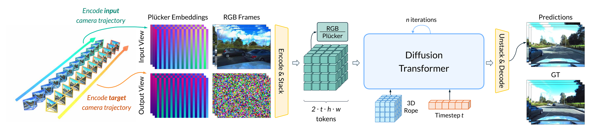

# AnyView: Synthesizing Any Novel View in Dynamic Scenes

Basile Van Hoorick, Dian Chen, Shun Iwase, Pavel Tokmakov, Muhammad Zubair Irshad, Igor Vasiljevic, Swati Gupta, Fangzhou Cheng, Sergey Zakharov, Vitor Guizilini

Toyota Research Institute

Published in ECCV 2026

[Paper](https://tri-ml.github.io/AnyView/AnyView.pdf) | [arXiv](https://arxiv.org/abs/2601.16982) | [Website](https://tri-ml.github.io/AnyView/) | [Results](https://tri-ml.github.io/AnyView/#results) | [Datasets](#anyviewbench) | [Model](#pretrained-model)



*AnyView encodes the input view's RGB frames and both views' camera trajectories (Plücker
embeddings) into one token stack, denoises with a diffusion transformer, and decodes the
target view.*

This repository contains the code published as part of our paper _"[AnyView: Synthesizing Any Novel View in Dynamic Scenes](https://tri-ml.github.io/AnyView/AnyView.pdf)"_ (abbreviated **AnyView**). We provide setup instructions, pretrained weights, inference code, the AnyViewBench evaluation suite, and finetuning code.

Table of contents:

- [Setup](#setup)
- [Pretrained Model](#pretrained-model)
- [Inference](#inference)
- [AnyViewBench](#anyviewbench)
- [Finetuning](#finetuning)
- [Dataset Generation](#dataset-generation)
- [License](#license)
- [Citation](#citation)

## Setup

You need Python 3.10 or newer and a CUDA GPU with bfloat16 support. Inference uses about 7 GB
of GPU memory (41 frames at the 576 grid). Finetuning uses 68 GB at the default settings (see
[Finetuning](#finetuning)). We verified the pip install below (torch 2.7.1, CUDA 12.6 wheels,
driver 535) and the Docker image. Both use plain PyTorch attention. They agree with the fused
attention implementation used for the paper to about 50 dB PSNR on the generated frames, with
identical benchmark scores.

```bash
python3 -m venv .venv && source .venv/bin/activate   # needs the python3-venv package on Debian/Ubuntu
pip install "torch>=2.7,<2.8" --index-url https://download.pytorch.org/whl/cu126
pip install -r requirements.txt
```

Run every command below from this directory. Nothing else needs to be on the Python path.

Docker route (the same install inside a CUDA + PyTorch image; the container is called
`anyview` in these docs):

```bash
docker build -t anyview .
docker run --gpus all -it --rm --user "$(id -u):$(id -g)" \
    -e TORCH_HOME=/workspace/anyview/.torch \
    -v "$PWD":/workspace/anyview anyview
```

This opens a shell in the container with the checkout mounted at the same relative layout, so
every command below runs unchanged there. To run one command on one GPU without a shell, drop
`-it` and append the command:

```bash
docker run --rm --gpus '"device=0"' --user "$(id -u):$(id -g)" \
    -e TORCH_HOME=/workspace/anyview/.torch -v "$PWD":/workspace/anyview anyview \
    python scripts/infer.py --help
```

Keep `checkpoints/` and `data/` as real files and directories inside the checkout (symbolic
links that point outside it are not visible in the container), or mount them from elsewhere
with more `-v` flags. `--user` keeps the outputs owned by you. `TORCH_HOME` caches the 528 MB
VGG weights that the LPIPS metric downloads on its first evaluation, so later runs work
offline.

The model is a 2-billion-parameter diffusion transformer built on
[NVIDIA cosmos-predict2](https://github.com/nvidia-cosmos/cosmos-predict2). It takes one input
video and generates one target video. Clips have 1 + 4k frames (13, 29, or 41 in the benchmark)
and a 576-pixel long side. Camera geometry enters the network as Plücker ray embeddings
computed from per-frame extrinsics and intrinsics. There is no text conditioning.

## Pretrained Model

| File | Description | Download |
| --- | --- | --- |
| `checkpoints/anyview_dvs_2b.pt` | AnyView model weights (576-pixel resolution), 3.95 GB | [anyview_dvs_2b.pt](https://s3.us-east-1.amazonaws.com/tri-ml-public.s3.amazonaws.com/datasets/anyview/checkpoints/anyview_dvs_2b.pt) ([sha256](https://s3.us-east-1.amazonaws.com/tri-ml-public.s3.amazonaws.com/datasets/anyview/checkpoints/anyview_dvs_2b.pt.sha256)) |
| `checkpoints/tokenizer.pth` | Video tokenizer from the NVIDIA Cosmos-Predict2-2B-Video2World release, redistributed under the NVIDIA Open Model License, 508 MB | [tokenizer.pth](https://s3.us-east-1.amazonaws.com/tri-ml-public.s3.amazonaws.com/datasets/anyview/checkpoints/tokenizer.pth) ([sha256](https://s3.us-east-1.amazonaws.com/tri-ml-public.s3.amazonaws.com/datasets/anyview/checkpoints/tokenizer.pth.sha256)) |
| `checkpoints/default_text_emb.pt` | Fixed text-conditioning embedding (the model is text-free; this 2 MB tensor replaces the prompt encoder) | [default_text_emb.pt](https://s3.us-east-1.amazonaws.com/tri-ml-public.s3.amazonaws.com/datasets/anyview/checkpoints/default_text_emb.pt) ([sha256](https://s3.us-east-1.amazonaws.com/tri-ml-public.s3.amazonaws.com/datasets/anyview/checkpoints/default_text_emb.pt.sha256)) |

```bash
(
set -e
mkdir -p checkpoints && cd checkpoints
for f in anyview_dvs_2b.pt tokenizer.pth default_text_emb.pt; do
    curl -O https://s3.us-east-1.amazonaws.com/tri-ml-public.s3.amazonaws.com/datasets/anyview/checkpoints/$f
    curl -O https://s3.us-east-1.amazonaws.com/tri-ml-public.s3.amazonaws.com/datasets/anyview/checkpoints/$f.sha256
    sha256sum -c $f.sha256
done
)
```

The scripts take the first two through their required `--ckpt` and `--tokenizer` arguments
and find the third automatically under `checkpoints/`. Data goes
under `data/`: unpack AnyViewBench to `data/AnyViewBench_zeroshot` (and, if wanted,
`data/AnyViewBench_indist`) and the Kubric-5D training scenes to `data/Kubric5D_tiny`. The
commands below use those paths.

## Inference

Inputs use the unified scene layout, the same layout as the benchmark and the Kubric-5D
training data: a `metadata.json`, one folder of frames per camera, and one `.npz` per frame
and camera with the pinhole intrinsics (3x3) and the camera-to-world extrinsics (4x4). Frames
can also be one `.mp4` per camera with a stacked `lowdim/<camera>.npz`. `cam1` is the input
camera and `cam0` the target camera:

```
episode/
  metadata.json
  rgb/cam1/0000000000.jpg ... 0000000040.jpg
  lowdim/cam0/0000000000.npz ... (intrinsics + cam2world of the target camera)
  lowdim/cam1/0000000000.npz ...
```

Generate the target-view video (`pred.mp4`, the frames as `frames/*.png`, and an `info.json`
with the resolutions used):

```bash
python scripts/infer.py \
    --episode path/to/episode \
    --ckpt checkpoints/anyview_dvs_2b.pt \
    --tokenizer checkpoints/tokenizer.pth \
    --out outputs/demo
```

Defaults: 35 denoising steps, seed 0, and the longest usable prefix of the episode (clip
lengths must be 1 + 4k frames and at most 41; `--num-frames` selects a shorter one).

## AnyViewBench

AnyViewBench is an evaluation benchmark for extreme dynamic view synthesis: every episode asks
for a large, instantaneous viewpoint change. Each episode provides an input video, the
ground-truth target-view video (`rgb/cam0/`), and the camera parameters of both views, in the
layout shown above. Episodes come from public driving, robotics, egocentric, and synthetic
video datasets.

The benchmark reports one headline number per metric: splits from the same source dataset are
averaged first (`groups` in `splits.json`; the four Argoverse camera pairs form one group), and
the global score is the unweighted mean over dataset groups.

AnyViewBench comes as two self-contained archives, each with its own index files:

- `AnyViewBench_zeroshot.tar.gz`: the zero-shot benchmark used in the table below; 5 datasets
  (Argoverse, AssemblyHands, DDAD, DROID, Ego-Exo4D), 320 episodes, 5.0 GB.
- `AnyViewBench_indist.tar.gz`: the in-distribution benchmark; 8 datasets (DROID, Ego-Exo4D,
  Kubric-4D, Kubric-5D, LBM, Lyft-L5, ParallelDomain-4D, Waymo), 444 episodes, 2.0 GB.

Download the zero-shot archive, check it, and unpack it under `data/`, which creates
`data/AnyViewBench_zeroshot`:

```bash
curl -O https://s3.us-east-1.amazonaws.com/tri-ml-public.s3.amazonaws.com/datasets/anyview/AnyViewBench_zeroshot.tar.gz
curl -O https://s3.us-east-1.amazonaws.com/tri-ml-public.s3.amazonaws.com/datasets/anyview/AnyViewBench_zeroshot.tar.gz.sha256
sha256sum -c AnyViewBench_zeroshot.tar.gz.sha256 && mkdir -p data && tar xzf AnyViewBench_zeroshot.tar.gz -C data/
```

The in-distribution archive unpacks the same way, to `data/AnyViewBench_indist`:

```bash
curl -O https://s3.us-east-1.amazonaws.com/tri-ml-public.s3.amazonaws.com/datasets/anyview/AnyViewBench_indist.tar.gz
curl -O https://s3.us-east-1.amazonaws.com/tri-ml-public.s3.amazonaws.com/datasets/anyview/AnyViewBench_indist.tar.gz.sha256
sha256sum -c AnyViewBench_indist.tar.gz.sha256 && mkdir -p data && tar xzf AnyViewBench_indist.tar.gz -C data/
```

Annotations, camera poses, index files, and TRI-generated data (Kubric-4D, Kubric-5D,
ParallelDomain-4D): CC BY 4.0. Pixels: the license of each source dataset, stated in that
dataset's `SOURCE_LICENSE.txt` and in the attribution list below. Ego-Exo4D and Waymo: no
pixels included; [docs/RESTRICTED_DATA.md](docs/RESTRICTED_DATA.md) describes how to rebuild
them from the official downloads.

Source dataset attributions:

- DROID: CC BY 4.0.
- Argoverse 2: (c) 2021 Argo AI, LLC, CC BY-NC-SA 4.0; frames were selected, resized, and
  repackaged for this benchmark.
- Lyft Level 5 (Woven Planet): CC BY-NC-SA 4.0; frames selected, resized, and repackaged.
- DDAD: (c) Toyota Research Institute, CC BY-NC-SA 4.0.
- AssemblyHands (building on Assembly101): CC BY-NC 4.0; frames selected, resized, and
  repackaged.
- Kubric-4D and Kubric-5D: generated by Toyota Research Institute with the Kubric simulator
  (Apache 2.0), released under CC BY 4.0.
- ParallelDomain-4D: (c) Toyota Research Institute, CC BY 4.0.
- LBM: real-robot manipulation videos collected at Toyota Research Institute, (c) 2025 Toyota
  Research Institute, CC BY 4.0.
- Ego-Exo4D: not redistributed; obtain via the official channels (see ego4d.dev, and
  docs/RESTRICTED_DATA.md).
- Waymo Open Dataset: not redistributed; obtain via waymo.com/open (see
  docs/RESTRICTED_DATA.md).

Evaluate a checkpoint on one split (peak signal-to-noise ratio, structural similarity, and
LPIPS perceptual distance per split, per dataset group, and as the global mean over groups):

```bash
python scripts/eval_avb.py \
    --avb-root data/AnyViewBench_zeroshot --splits droid_OOD_LR \
    --ckpt checkpoints/anyview_dvs_2b.pt \
    --tokenizer checkpoints/tokenizer.pth \
    --out outputs/avb_eval
```

`--splits all` (the default) evaluates every split of the tree; splits without pixels
(Ego-Exo4D, Waymo) are skipped with a notice unless you rebuild them. One episode takes about
25 seconds on an H100 (35 denoising steps); the full benchmark of 764 episodes takes about
5.5 hours on one GPU, and `--stop-after N` evaluates only the first N episodes of each split
for a quick check. Outputs: `table.txt`, `results.json`, `results.csv`, and one input |
prediction | ground-truth comparison video per episode. The first evaluation downloads the
528 MB VGG weights used by the LPIPS metric into the PyTorch cache, so it needs network
access once. Evaluation runs at the model's 576 grid with the same noise for every episode;
the exact resize rule, the seed convention, and the metric definitions are in
[docs/PROTOCOL.md](docs/PROTOCOL.md).

Reference results of the released checkpoint on the zero-shot datasets (PSNR / SSIM / LPIPS,
35 steps; a dataset row is the unweighted mean over its camera-pair splits, the zero-shot
mean is the unweighted mean over the rows). The command above with `--splits droid_OOD_LR`
gives 11.15 / 0.333 / 0.642:

| dataset (episodes) | this release | paper |
| --- | --- | --- |
| Argoverse 2 (64) | 11.89 / 0.389 / 0.657 | 11.87 / 0.388 / 0.645 |
| AssemblyHands (64) | 10.52 / 0.283 / 0.717 | 10.39 / 0.275 / 0.711 |
| DDAD (64) | 10.58 / 0.304 / 0.581 | 10.63 / 0.314 / 0.568 |
| DROID, held-out labs (64) | 11.91 / 0.397 / 0.613 | 11.98 / 0.399 / 0.603 |
| Ego-Exo4D, held-out (64) | 12.97 / 0.273 / 0.588 | 13.02 / 0.281 / 0.578 |
| zero-shot mean | 11.57 / 0.329 / 0.631 | 11.58 / 0.331 / 0.621 |

Small differences to the paper come from the image resizing path used when the paper's
numbers were computed; see the `--legacy-bake` option of `scripts/eval_avb.py` to reproduce
them exactly, and [docs/PROTOCOL.md](docs/PROTOCOL.md) for the details.

## Finetuning

The finetuning script implements the training procedure used for AnyView (the same denoising
objective, noise-level sampling, loss weighting, and optimizer recipe). This repository provides
Kubric-5D as the example dataset; the paper trained on a mixture of more than ten datasets.
Adapting the script to other data means writing a loader that returns the same sample format
as `anyview/kubric_dataset.py`.

Kubric-5D scenes come in the unified scene layout (one directory per scene with
`metadata.json`, `rgb/<camera>.mp4`, and `lowdim/`). They were generated with the
[Kubric-5D pipeline](https://github.com/TRI-ML/Kubric-5D). The 10,000 scenes are split into
train (`scn00000` to `scn09599`), val (`scn09600` to `scn09799`) and test (`scn09800` to
`scn09999`); the kubric5d episodes of AnyViewBench are clips of test scenes. The archives, all
under `https://s3.us-east-1.amazonaws.com/tri-ml-public.s3.amazonaws.com/datasets/anyview/`:

- `Kubric5D_tiny.tar.gz`: 100 training scenes for trying the finetuning script, 2.2 GB, extracts to `Kubric5D_tiny/`
- `Kubric5D_val.tar.gz`: 200 scenes, 4.32 GB, extracts to `Kubric5D_val/`
- `Kubric5D_test.tar.gz`: 200 scenes, 4.25 GB, extracts to `Kubric5D_test/`
- `Kubric5D_train_part00.tar.gz` to `Kubric5D_train_part09.tar.gz`: 960 scenes each in scene order, 20.5 to 20.8 GB each (207 GB in total), all extract into `Kubric5D_train/`

Each archive has a `.sha256` file next to it, and `Kubric5D_index.json` lists every archive
with its size, checksum and scene range. One command downloads all of them (216 GB), checks
every file against its sha256, and resumes if interrupted (complete files are skipped):

```bash
python scripts/download.py --tier Kubric5D --out data/
```

`--only` takes name patterns for a selection, e.g. `--only 'Kubric5D_val*' 'Kubric5D_test*'`
or `--only 'Kubric5D_train_part0[0-2]*'`. The plain shell equivalent, followed by extraction
(the train parts all land in `data/Kubric5D_train/`):

```bash
(
set -e
mkdir -p data && cd data
for f in Kubric5D_val Kubric5D_test Kubric5D_train_part0{0..9}; do
    curl -fLO https://s3.us-east-1.amazonaws.com/tri-ml-public.s3.amazonaws.com/datasets/anyview/$f.tar.gz
    curl -fLO https://s3.us-east-1.amazonaws.com/tri-ml-public.s3.amazonaws.com/datasets/anyview/$f.tar.gz.sha256
    sha256sum -c $f.tar.gz.sha256
done
for f in Kubric5D_*.tar.gz; do tar xzf $f; done
)
```

The tiny subset alone:

```bash
(
set -e
mkdir -p data && cd data
curl -fLO https://s3.us-east-1.amazonaws.com/tri-ml-public.s3.amazonaws.com/datasets/anyview/Kubric5D_tiny.tar.gz
curl -fLO https://s3.us-east-1.amazonaws.com/tri-ml-public.s3.amazonaws.com/datasets/anyview/Kubric5D_tiny.tar.gz.sha256
sha256sum -c Kubric5D_tiny.tar.gz.sha256 && tar xzf Kubric5D_tiny.tar.gz
)
```

Each training sample is a random pair of cameras from one scene over a random window of 41
frames. The script warm-starts from the released checkpoint and runs one process per GPU:

```bash
torchrun --nproc_per_node=2 scripts/train_dvs.py \
    --data-root data/Kubric5D_tiny \
    --ckpt checkpoints/anyview_dvs_2b.pt \
    --tokenizer checkpoints/tokenizer.pth \
    --out outputs/finetune --max-steps 500
```

Defaults (all visible in `--help`): learning rate 2e-6 with 100 warmup steps then linear
decay, weight decay 0.1, 41-frame clips at the 576 grid, batch size 1 per GPU, a bf16
checkpoint (about 4 GB, same layout as the released one) every 250 steps and at the end, named
`anyview_dvs_step<step>.pt` with a six-digit step number. The first 100 steps are warmup, so
expect a few hundred steps before the finetune has a visible effect. Checkpoints written to
`--out` load directly into `scripts/infer.py` and `scripts/eval_avb.py` via `--ckpt`.
Kubric-5D scenes have 16 cameras named `cam00` to `cam15` and 60 frames, so inference on one
of them names the camera pair explicitly; the script uses the first 41 frames (the longest
supported prefix, chosen automatically):

```bash
python scripts/infer.py \
    --episode data/Kubric5D_tiny/scn00000 --input-cam cam00 --target-cam cam01 \
    --ckpt outputs/finetune/anyview_dvs_step000500.pt \
    --tokenizer checkpoints/tokenizer.pth \
    --out outputs/demo_finetuned
```

Measured peak memory per GPU (batch 1, activation checkpointing on): 68 GB at the default 41
frames and 576 grid on one GPU, 76 GB per GPU with two GPUs (the distributed gradient
buffers add to it), 54 GB with `--num-frames 21`, 46 GB with `--resolution 320`. The fp32
master weights plus AdamW state alone take 32 GB, so 48 GB cards fit only the reduced settings
and 80 GB cards are needed for the default.

## Dataset Generation

The Kubric-4D and Kubric-5D scenes were generated with the public
[Kubric-5D pipeline](https://github.com/TRI-ML/Kubric-5D), built on
[Kubric](https://github.com/google-research/kubric).

## License

Code: CC BY-NC 4.0 ([LICENSE](LICENSE)). Vendored NVIDIA code (`anyview/vendor/`): Apache 2.0
(THIRD_PARTY_LICENSES). Model weights: derived from NVIDIA Cosmos-Predict2, NVIDIA Open Model
License. AnyViewBench annotations, poses and index files: CC BY 4.0. Pixels: the license of each
source dataset, in that dataset's `SOURCE_LICENSE.txt`.

Copyright (c) 2026 Toyota Research Institute.

## Citation

If you use this work, please cite the paper:

```bibtex
@inproceedings{vanhoorick2026anyview,
  title={AnyView: Synthesizing Any Novel View in Dynamic Scenes},
  author={Van Hoorick, Basile and Chen, Dian and Iwase, Shun and Tokmakov, Pavel and Irshad, Muhammad Zubair and Vasiljevic, Igor and Gupta, Swati and Cheng, Fangzhou and Zakharov, Sergey and Guizilini, Vitor Campagnolo},
  booktitle={European Conference on Computer Vision (ECCV)},
  year={2026}
}
```
